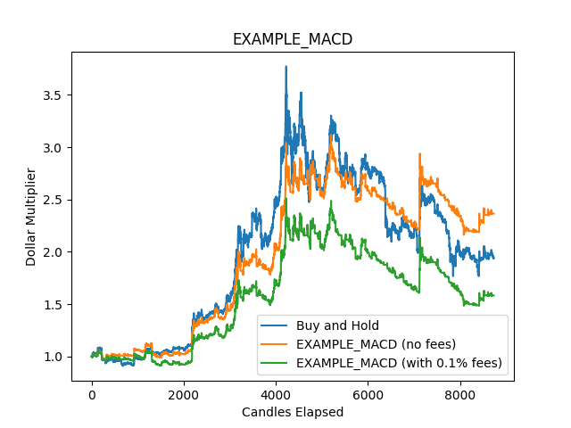

# Quant Workspace
An organized way to develop and test quantitative trading strategies

## How do I use it?

See [the docs](docs/index.md).

## What is included?

**Features:**

- Downloading trading data (stocks and cryptocurrencies)
- Backtesting strategies and parameters against data
- One workspace organized into indicators, strategies, backtests, data, data downloaders, and plots
- Storing API keys
- Useful metrics

**Files:**

- An example indicator, strategy, backtest style, backtest, data file, and plot (They are not that viable for real trading, but they are included to show how quant-workspace works.)
- Non-example local files are excluded from the repo by its `.gitignore`

## Why?

Every time I worked on a strategy, I used to make a new folder and do everything from stratch because I wanted to get right to work. I realized that this wasn't organized, and I was rewriting the same downloading and backtesting code, so I am making a solution to handle all of it once.
