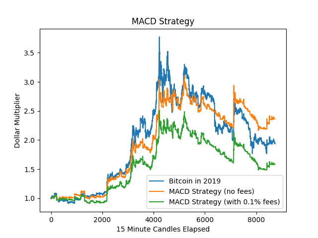

# Quant Workspace
An organized way to develop and test quantitative trading strategies.

## Why?

Every time I worked on a strategy, I used to make a new folder and do everything from stratch because I wanted to get right to work. I realized that this wasn't organized, and I was rewriting the same downloading and backtesting code, so I am making a solution to handle all of it once.

## What is included?

Features:

- Downloading trading data (stocks and cryptocurrencies)
- Backtesting strategies against data
- Storing API keys

Files:

- An example indicator, strategy, and backtest. They are not viable for real trading, but they are included to show how quant-workspace works.
- Local API keys, data files, indicators, strategies, backtests, and plots are excluded from the repo by its `.gitignore`
